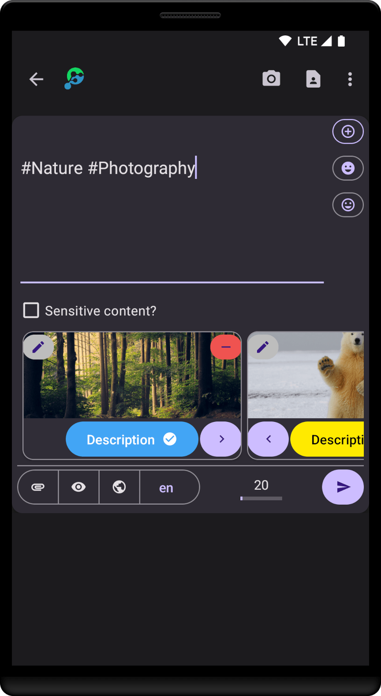
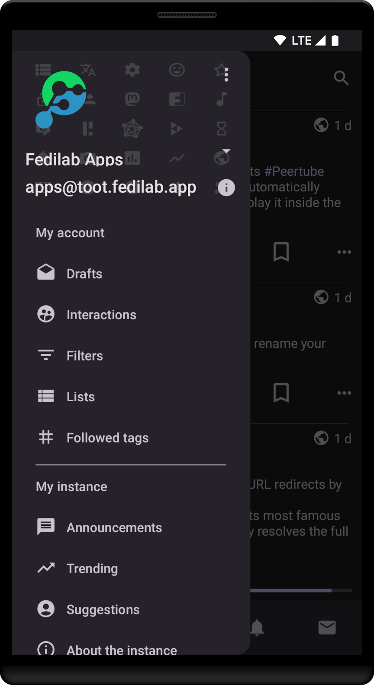

# Fedilab
A multi-accounts client for Mastodon, Pleroma, Friendica and Pixelfed

## Screenshots

&nbsp;&nbsp;

&nbsp;&nbsp;

&nbsp;&nbsp;

## Download

&nbsp;&nbsp;

## Translate

- [Weblate](https://hosted.weblate.org/engage/fedilab/)

## Donate

- [Liberapay](https://liberapay.com/tom79/donate)
- [Open Collective](https://opencollective.com/fedilab)
- [More...](https://fedilab.app/page/donations/)

## Resources

- [Wiki](https://wiki.fedilab.app)
- [Releases + Changelogs](https://codeberg.org/tom79/Fedilab/releases)

## Contact
- Fedi: [toot.fedilab.app/@apps](https://toot.fedilab.app/@apps)

